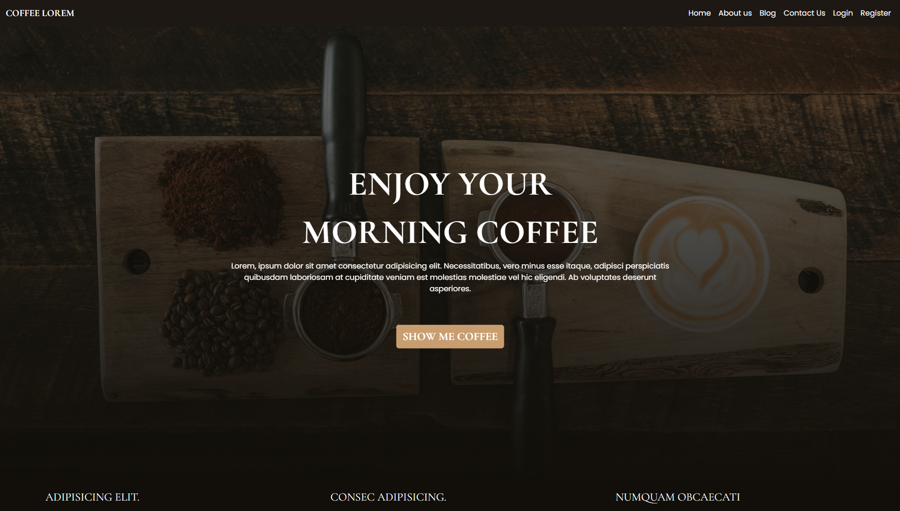

## A Simple Coffee Shop CMS System Powered by <span style="color:  #FF2D20;  font-weight: bold;">LARAVEL</span>



### Tech stacked used 
<div style="margin-bottom:1rem;margin-top:1.5rem; display: grid; grid-template-columns: repeat(6, 35px); grid-gap: 20px;">
  
  
  
  
  
  
</div>


### Install Dependencies
```
npm isntall
composer install
```

### To Run The Project
```
npm run dev 
php artisan serve
```
